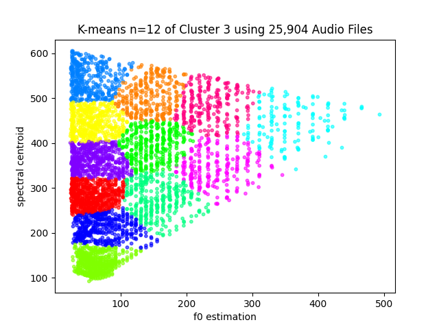
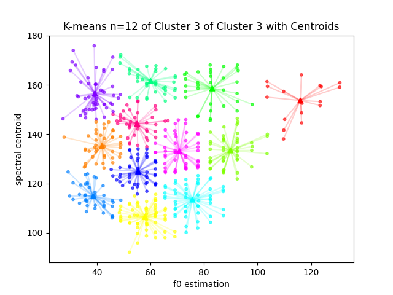
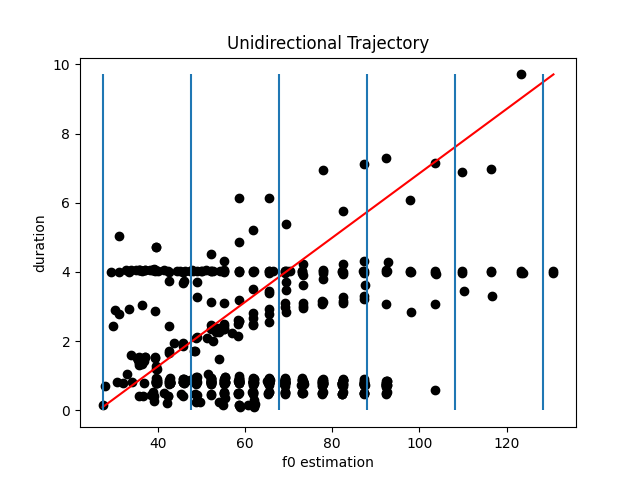
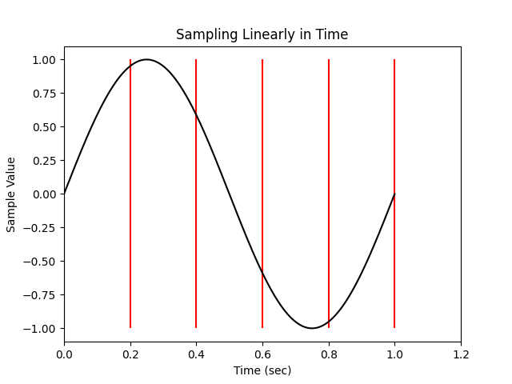
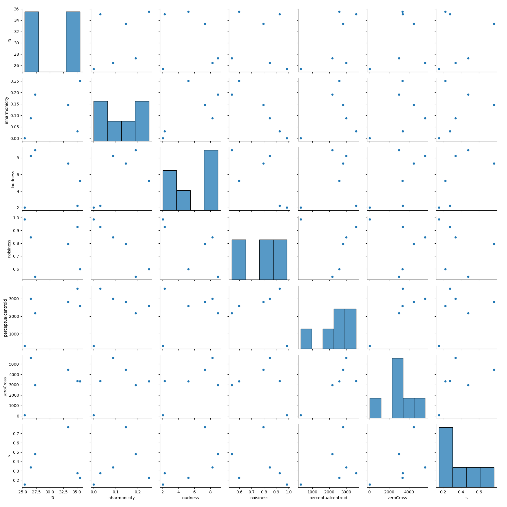
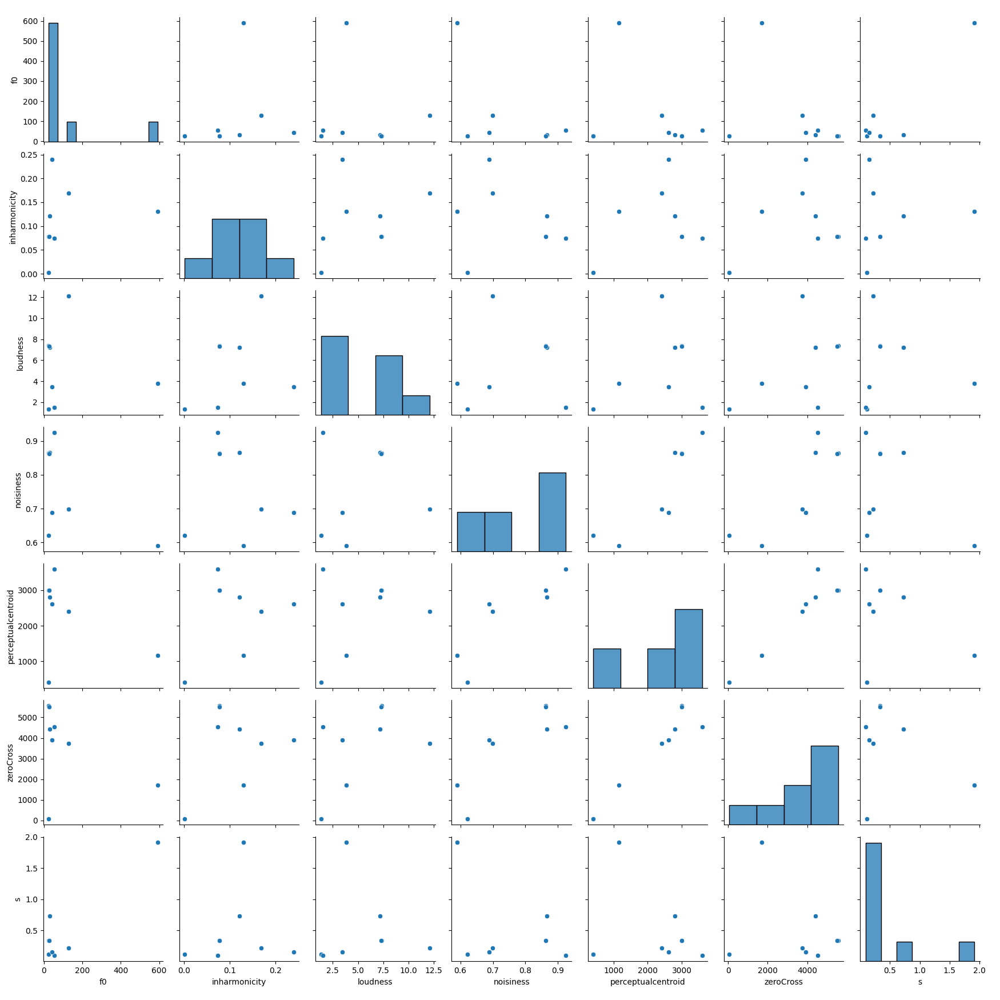
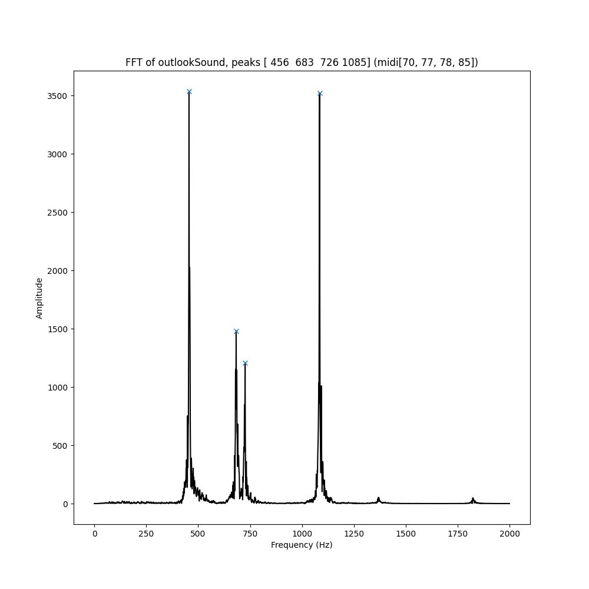
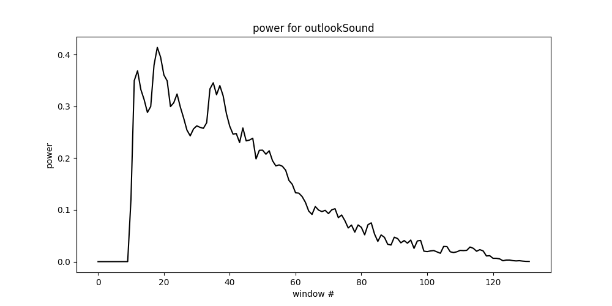
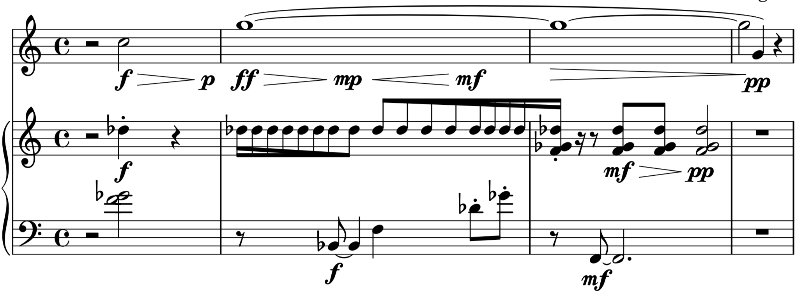

# Music Information Retrieval Driven Algorithmic Music 

## Stewart Engart

UC Santa Barbara, December 04, 2021

---

## What is MIR?

### Music Information Retrieval

segmentation
analysis

---

## How is MIR being used?

copyright enforcement (royalties, plagarism)
playlist recommendations (mood, emotion, style)
querying by humming, etc.

---

## How has this been applied to composition?

"We propose that problems arise not necessarily due to the sheer volume of decisions and possibilities, but due to a lack of strategic methods to hierarchize decision-making and to interconnect programmatically different strata of sonic experience."

Hackbarth, p 50.

---

### Concatenative Synthesis

1. analysis
2. database
3. unit selection
4. synthesis

Almeida, p 11.

---

### Concatenative Synthesis

"The convention adopted here is that when the result bears little resemblance to the original, then the transformation is more synthesis than effect"

Sturm, p 48.

---

## Results of survey of expert MIR users by Anderson and Knees

1. Surprise and serendipity in recommendation and retrieval are important to support creative work.
2. Users have personal mental images of sound.
3. There is a need for semantic representations of sounds for retrieval, which are not just tags and words but rather reflect those mental images (which can be visual or haptic).
4. Instead of “more of the same” recommendations, desired features are surprise, opposition, individuality, and control over the recommendation process.

---
## Searching a database from Blum, 1999.

1. Simile
2. Acoustical/perceptual features
3. Subjective features
4. Onomatopocia

---

## How did I get here?

---

### Past compostions

|                 				Piece 			               	| Techniques                                          	|
|:------------------------------------:	|-----------------------------------------------------	|
| Tears of Tesla 2: Electric Boogaloo 			 	| analysis of amplitude for visualization             	|
| Come On, America! 	\*		                   	| analysis, formant synthesis, parameter modulation   	|
|  Peace? Through the Night 			           	| time stretched use of pre-existing material         	|
| The Problem with Pandas              	| extraction of rhythmic contours from tape           	|
|  vizual \*			                             	| analysis/re-synthesis, visualization (oscilloscope) 	|
| Je me suis trouvé \*                   	| concatenative synthesis, analysis of sound grains   	|

\* included on recital

---

## Salient features

- Zero crossing rate (ZCR)
- Root mean square (RMS)
- Spectral centroid (brightness) 
- Spectal rolloff (distribution) 
- Harmonicity (vowels, how harmonic) 
- Pitch (first peak)

From Sturm, p. 51.

---

## Clustering

"When face with a set of objects, people often sort them into clusters to reduce information load and facilitate further processing."

Tversky, p 342.

---

Supervised vs. unsupervised
*KONTAKTE* by Stockhausen

---

---

---
## Dealing with high dimensions

weighting of features
multiple passes
Principal component analysis (PCA)

---
## Sound design

Querying for a desired sound based off of features rather than manipulation of an audio file to fit.

Implication to source identification.

---

## Referential and iconic sounds

- the isomorphic image (iconic, referential), im-sound.
- the diagram, a selection of simplified contours (indexical), di-sound.
- the metaphor/metaform, associated with a general concept (sign of), me-sound.

Bayle, p 168. 

---

"A plunderphone is a recognizable sonic quote, using the actual sound of something familiar which has already been recorded...The plundering has to be blatant..."

Plunderphonics - Interviews

---

# Trajectories

---
# Control Signals

---

## Anchor units

Stoll, 2009.

---
## Personal Audio Corpus

---

## Application, two approaches

**_Usynlig_**, stereo fixed media (2021)

**_A More Sound Outlook &reg;_**, for marimba and bass clarinet (2021)

---

## *Usynlig*

---

---

---
## *A More Sound Outlook &reg;*

---

---

---

---

## Future Work

---

## Analysis

---

## Mixed Music

---

## Pedagogy

---

## Interface Design

---

## Bibliography

Almeida, Gilberto Bernardes de. “COMPOSING MUSIC BY SELECTION CONTENT-BASED ALGORITHMIC-ASSISTED AUDIO COMPOSITION,” n.d., 231.

Andersen, Kristina, and Peter Knees. “CONVERSATIONS WITH EXPERT USERS IN MUSIC RETRIEVAL AND RESEARCH CHALLENGES FOR CREATIVE MIR.” New York City, 2016, 7.

Bayle, François. “Image-of-Sound, or i-Sound: Metaphor/Metaform.” Contemporary Music Review 4, no. 1 (January 1989): 165–70. https://doi.org/10.1080/07494468900640261.

Blum, Thomas L., Douglas F. Keislar, James A. Wheaton, and Erling H. Wold. Method and article of manufacture for content-based analysis, storage, retrieval, and segmentation of audio information. United States US5918223A, filed July 21, 1997, and issued June 29, 1999. https://patents.google.com/patent/US5918223A/en.

---

Hackbarth, Benjamin, Norbert Schnell, Philippe Esling, and Diemo Schwarz. “Composing Morphology: Concatenative Synthesis as an Intuitive Medium for Prescribing Sound in Time.” Contemporary Music Review 32, no. 1 (February 2013): 49–59. https://doi.org/10.1080/07494467.2013.774513.

“Plunderphonics - Interviews.” Accessed September 1, 2021. http://www.plunderphonics.com/xhtml/xinterviews.html.

Stoll, Thomas M. “BEYOND CONCATENATION: SOME IDEAS FOR THE CREATIVE USE OF CORPUS-BASED SONIC MATERIAL,” 2009, 4. http://hdl.handle.net/2027/spo.bbp2372.2009.044.

Sturm, Bob L. “Adaptive Concatenative Sound Synthesis and Its Application to Micromontage Composition.” Computer Music Journal 30, no. 4 (December 2006): 46–66. https://doi.org/10.1162/comj.2006.30.4.46.

Tversky, Amos. “Features of Similarity.” Psychological Review 84, no. 4 (1977): 327–52. https://doi.org/10.1037/0033-295X.84.4.327.
